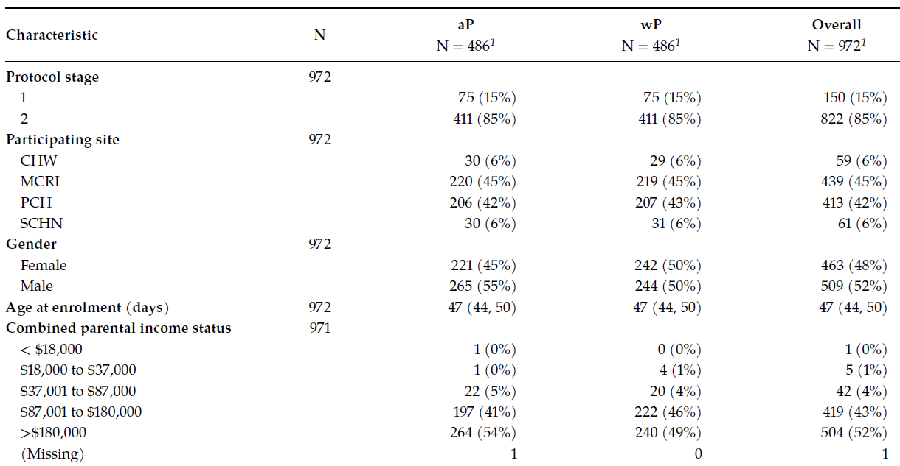
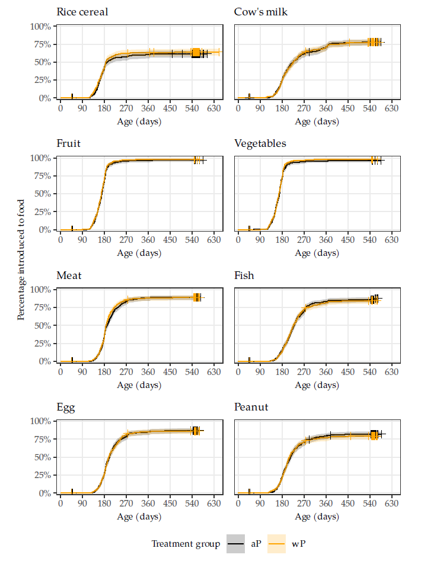
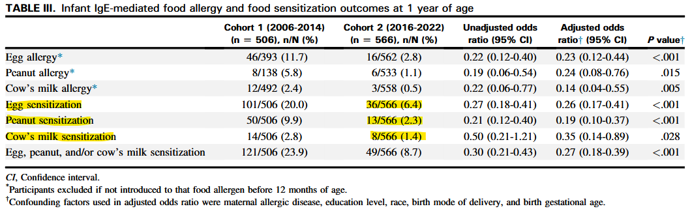
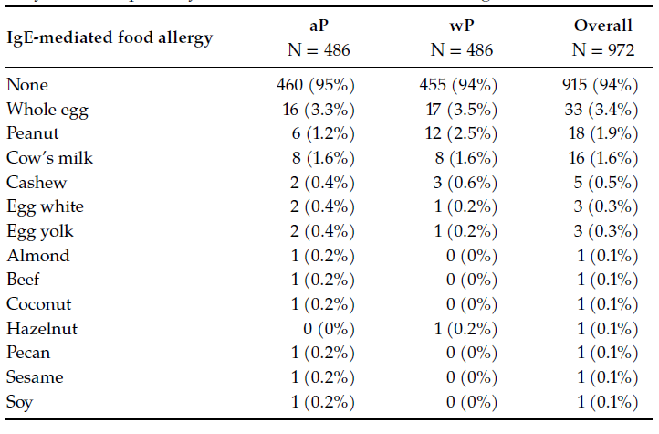
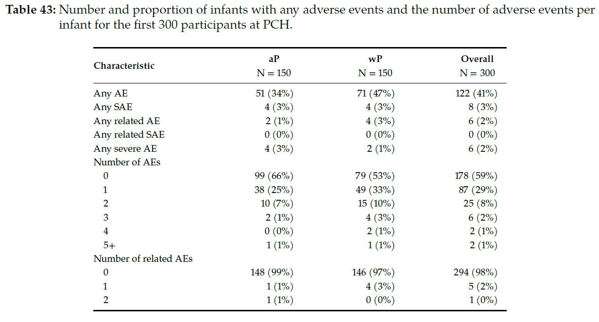

<h1>The OPTIMUM Trial - Results</h1>
\
<h2>OPTimising IMmunisation Using Mixed schedules</h2>
\
<h3>DSMB Meeting</h3>
\
<h3>2026-06-23</h3>
\

## Outline

- Trial design
- Outcome definitions
- Participant characteristics
- Outcomes
  - skin prick test sensitisation
  - food allergy
  - eczema
- Safety

## Trial Design

- Parallel group, two-arm, randomised trial
- Interventions
  - Combined Diphtheria (D)-Tetanus (T)-acellular Pertussis (aP), Hepatitis B (HepB), Inactivated Poliovirus (IPV) and Haemophilus influenzae type b (Hib) vaccine (DTaP-HepB-IPV-Hib) administered at approximately 2 months (referred to as **aP**), or
  - Combined Diphtheria (D)-Tetanus (T)-whole-cell Pertussis (wP), Hepatitis B (HepB) and Haemophilus influenzae type b (Hib) vaccine (DTwP-HepB-Hib) in place of DTaP-HepB-IPVHib at approximately 2 months (referred to as **wP**), 

  together with the vaccines recommended by the National Immunisation Program.

- Originally, a maximum sample size of 3,000 participants randomised 1:1
  - revised to 2,000 participants due to feasibility constraints
  - stopped early just before 1,000 participants randomised due to inability to procure IMP

## Primary Outcome Definition

IgE-mediated food allergy with evidence of food sensitisation on skin prick test (SPT) by 12-months old and confirmed (where necessary) by medically supervised oral food challenge(s) (OFC).

::: {.fragment}

Primary endpoint met if either of the following criteria were reached:

- **Criteria 1: Unequivocal IgE-mediated food allergy**
  
  i. **Positive OFC** with evidence of *sensitisation on SPT* to the food of interest; **OR**

  ii. **Clinician-confirmed food anaphylaxis**, affecting $\geq$ 2 of the following systems: skin, gastrointestinal tract, respiratory tract, cardiovascular system; **AND** evidence of *sensitisation on SPT* to the food of interest.

:::

::: {.fragment}

- **Criteria 2: Highly probable IgE-mediated food allergy**

  - A history of food allergic reaction (consistent with PRACTALL criteria), with evidence of *sensitisation on SPT* to the food of interest.

Sensitistaion on SPT for a specific food was defined as an SPT wheal size >1mm than that produced by a negative control solution.

:::

## Key Secondary Outcome Definitions

*Eczema:* A history of parent-reported clinician-diagnosed new-onset eczema by

- [2.a.] 6-months of age
- [2.b.] 12-months of age

**AND** a positive SPT to *any* allergen by approximately 12-months old.

\

::: {.fragment}

*Skin prick test sensitisation:* A skin prick test

- [2.c] >1mm greater than the negative control
- [2.d] ≥3mm greater than the negative control

to at least one allergen by approximately 12-months of age.

:::

::: {.fragment}
For both primary and secondary "approximately 12-months old" taken to be 12-months to <19-months old.
:::

## Schedule of Assessments (SPT/OFC)

- **Visit 1 (6 to <12 weeks of age)**
  - eligibility, baseline status, administration of study vaccine as assigned, other routine vaccines
- **Visit 2 (12 to <15 months of age)**
  - skin prick test ASAP after 12-months and no later than 18-months of age
- **OFC Visit**
  - oral food challenge organised (12 to <18-months) if positive SPT or at discretion of site PI on basis of history of allergic reaction or food intolerance
- **Unscheduled SPT**
  - at discretion of site PI if suspected IgE-mediated food reaction
- **SPT panel of allergens**
  - cow's milk, hen egg, peanut, cashew, house dust mite (*Dermatophagoides pteronyssinus*), cat dander, rye grass *Lolium perenne*)
  - other's at discretion of site PI

## Participants

- There were 972 participants randomized at 4 sites in Australia, 486 per treatment group. 
- The first participant was randomised on 2018-03-07 and the final participant was​ randomised on 2023-12-22

## Characteristics

## Introduction of Foods

:::: {.columns}

::: {.column width="50%"}

{fig-align=center}

:::

::: {.column width="50%"}

"Has *X* been given for the first time since the last visit? If so, what date/age?" 

\

Only stage 2 participants shown, FHQ scheduled at approximately:

- 6-weeks
- 6-months
- 9-months
- 12-months
- 15-months
- 18-months

:::

::::

## Skin Prick Tests

:::: {.columns}

::: {.column width="40%"}
Number and percentage of infants with an SPT result.

\
There were 23 participants with no documented SPT result.
:::

::: {.column .fragment width="60%"}

Early stage 1 protocol change from SPT at 18-months to 12-months.

:::

::::

## SPT Sensitisation Outcomes

:::: {.columns}

::: {.column width="50%"}

:::

::: {.column width="50%"}

::: {.fragment}

:::

::: {.fragment}

:::

:::

::::

::: {.fragment}

{.absolute bottom=350 left=-50}

::: {style="font-size: 40%;"}

Walker S, D'Vaz N, Pretorius R ... Infant Diet Recommendations Reduce IgE-Mediated Egg, Peanut, and Cow’s Milk Allergies The Journal of Allergy and Clinical Immunology: In Practice, 2025; 13, 3077-3083.e1 - *"Food allergen sensitization was defined as a positive skin prick test (mean weal diameter ≥3 mm above the negative control weal size) to at least 1 food allergen." At 12-months of age. Born in Perth, Australia*

:::

:::

## SPT Sensitisation Results

:::: {.columns}

::: {.column width="70%"}

{fig-align=center height=350}

{fig-align=center height=500}

:::

::: {.column width="30%"}

::: {style="font-size: 80%;"}

Estimated difference in SPT (>1mm) sensitisation probability (wP vs. aP): ​

::: {.list-table aligns="c"}

- - Median (95% CrI)

- - 0.01 (-0.04, 0.06)

:::

→ Uncertain direction, but any benefit likely
to be small​

\

Allergic sensitisation similar in both groups. Vaccine type did not appear to influence early sensitisation.

:::

:::

::::

::: {.aside}

::: {style="font-size: 70%;"}

Adjusted for site, sex, breastfeeding status, birth order, parental income, mode of delivery, family history of atopic disease.

:::

:::

## IgE-mediated Food Allergy Outcomes

::: {style="font-size: 70%;"}

- Criteria 1.i - positive OFC
- Criteria 1.ii - clinician-confirmed food anaphylaxis
- Criteria 2. - highly probable IgE-mediated food allergy

All requiring SPT sensitisation.

:::

:::: {.columns}

::: {.column width="50%"}

::: {.fragment}

:::

::: {.fragment}

:::

:::

::: {.column width="50%"}

::: {.fragment}

:::

:::

::::

## IgE-mediated Food Allergy Results

:::: {.columns}

::: {.column width="70%"}

:::

::: {.column width="30%"}

::: {.fragment style="font-size: 80%;"}

Estimated difference in SPT (>1mm) sensitisation probability (wP vs. aP): ​

::: {.list-table aligns="c"}

- - Median (95% CrI)

- - 0.01 (-0.02, 0.04)

:::

→ Uncertain, but any benefit likely to be small​

\

Food allergy rates were similar in both groups. 
Results do not show a reduction in IgE-mediated food allergy.

:::

:::

::::

## Eczema Outcomes

:::: {.columns}

::: {.column width="40%"}

:::

::: {.column .fragment width="60%"}

:::

::::

## Eczema Results

:::: {.columns}

::: {.column width="70%"}

{fig-align=center height=550}

:::

::: {.column width="30%"}

::: {.fragment}

::: {style="font-size: 80%;"}

Estimated difference in probability of eczema by 6-months (wP vs. aP): ​

::: {.list-table aligns="c"}

- - Median (95% CrI)

- - -0.01 (-0.04, 0.02)

:::

→ Uncertain direction, but any benefit likely to be small​

\

Eczema rates were similar between groups. Results do not show a reduction in eczema.

:::

:::

:::

::::

## Safety

# End
