<h1>The OPTIMUM trial</h1>
\
<h2>OPTimising IMmunisation Using Mixed schedules</h2>
\
<h3>DSMB Meeting</h3>
\
<h3>2026-06-23</h3>
\

# Background

# Outcomes

## Primary Outcome Definition

IgE-mediated food allergy with evidence of food sensitisation on skin prick test (SPT) by 12-months old and confirmed (where necessary) by medically supervised oral food challenge(s) (OFC).

Primary endpoint met if either of the following criteria were reached:

- **Criteria 1: Unequivocal IgE-mediated food allergy**
  
  i. **Positive OFC** with evidence of *sensitisation on SPT* to the food of interest; **OR**

  ii. **Clinician-confirmed food anaphylaxis**, affecting $\geq$ 2 of the following systems: skin, gastrointestinal tract, respiratory tract, cardiovascular system; **AND** evidence of *sensitisation on SPT* to the food of interest.

- **Criteria 2: Highly probable IgE-mediated food allergy**

  - A history of food allergic reaction (consistent with PRACTALL criteria), with evidence of *sensitisation on SPT* to the food of interest.

Sensitistaion on SPT for a specific food was defined as an APT wheal size >1mm than that produced by a negative control solution.

## Key Secondary Outcome Definitions

*Eczema:* A history of parent-reported clinician-diagnosed new-onset eczema by

- [2.a.] 6-months of age
- [2.b.] 12-months of age

**AND** a positive SPT to *any* allergen by approximately 12-months old.

\

::: {.fragment}

*Skin prick test sensitisation:* A skin prick test

- [2.c] >1mm greater than the negative control
- [2.d] ≥3mm greater than the negative control

to at least one allergen by approximately 12-months of age.

:::

## Schedule of Assessments

## Participants

- There were 972 participants randomized at 4 sites in Australia, 486 per treatment group. 
- The first participant was randomised on 2018-03-07 and the final participant was​ randomised on 2023-12-22

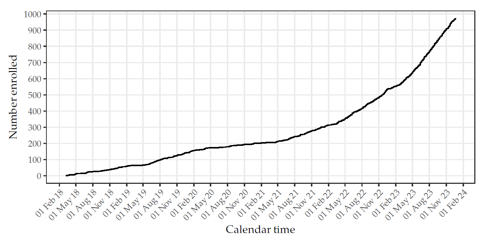

## Characteristics

## Skin Prick Tests

:::: {.columns}

::: {.column width="40%"}
Number and percentage of infants with an SPT result.
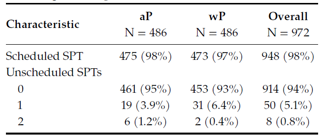
\
There were 23 participants with no documented SPT result.
:::

::: {.column width="60%"}
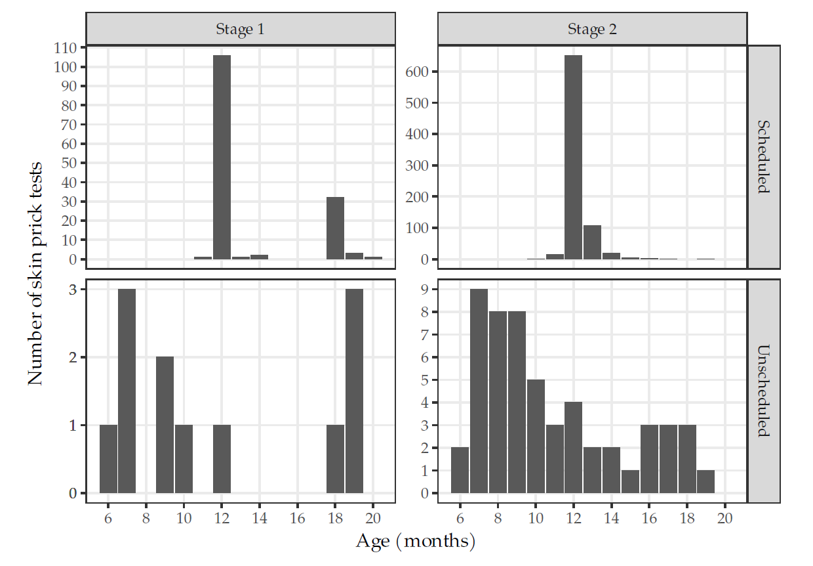
:::

::::

## SPT Sensitisation Outcomes

:::: {.columns}

::: {.column width="50%"}
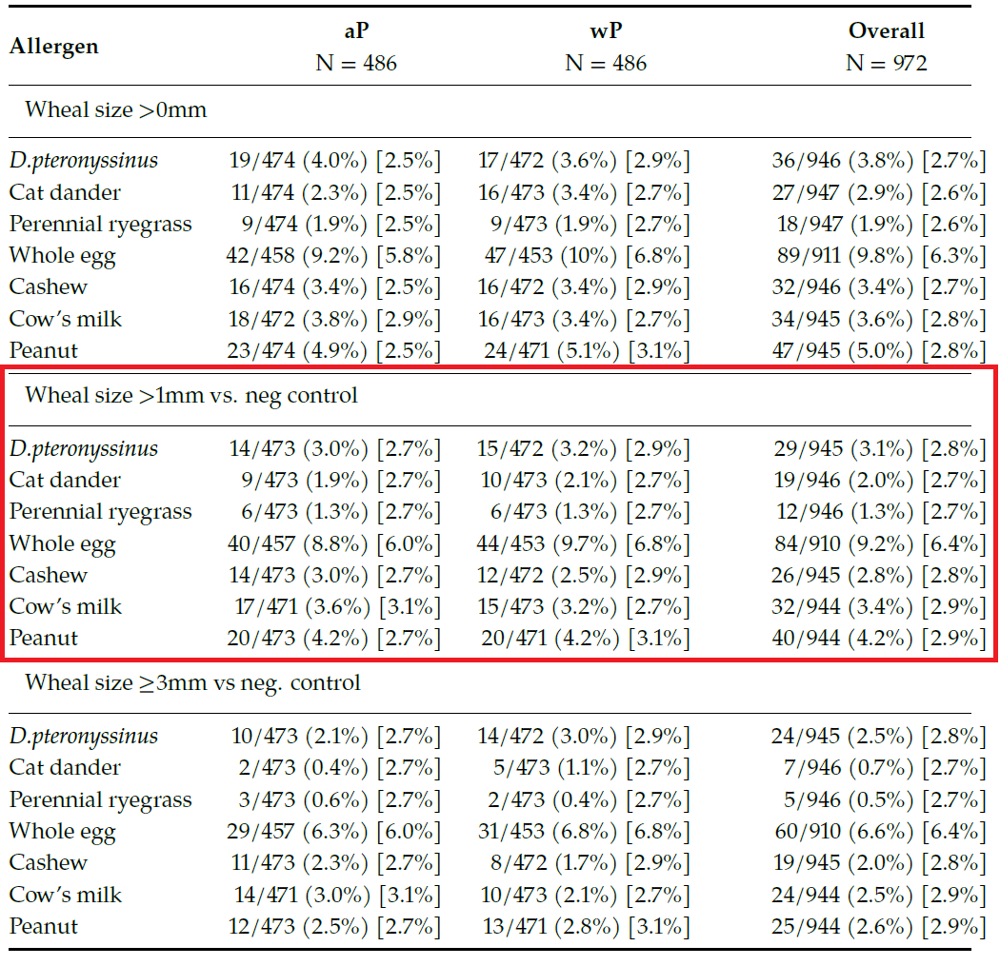
:::

::: {.column width="50%"}

::: {.fragment}

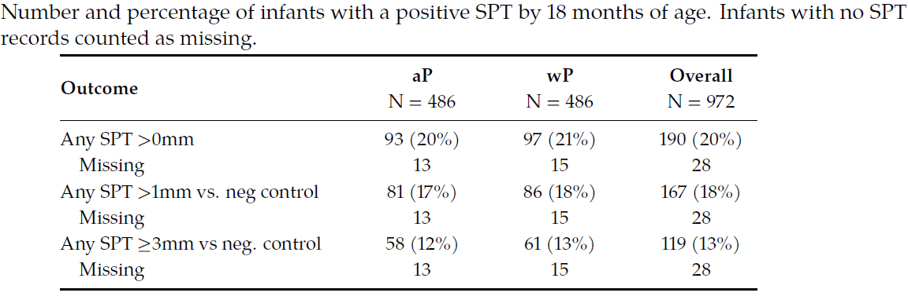

:::

::: {.fragment}

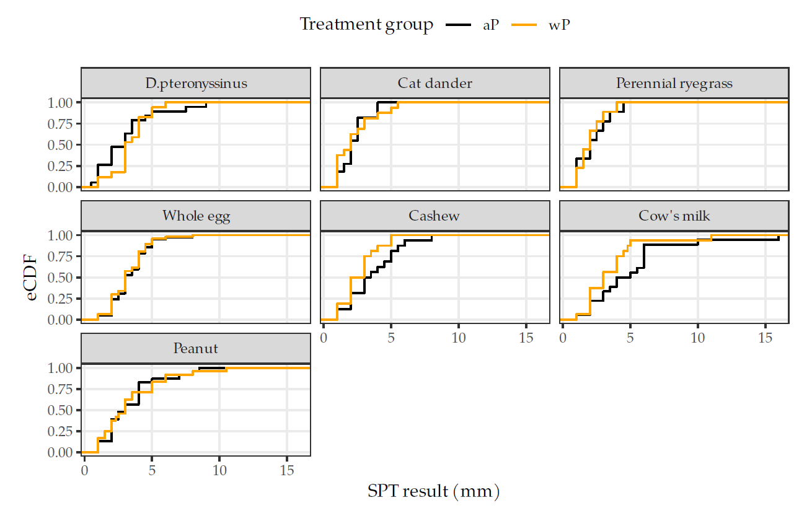

:::

:::

::::

## SPT Sensitisation Results

:::: {.columns}

::: {.column width="70%"}

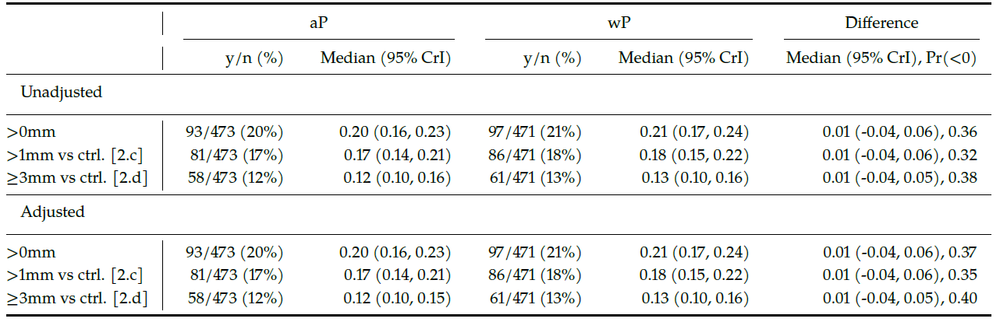

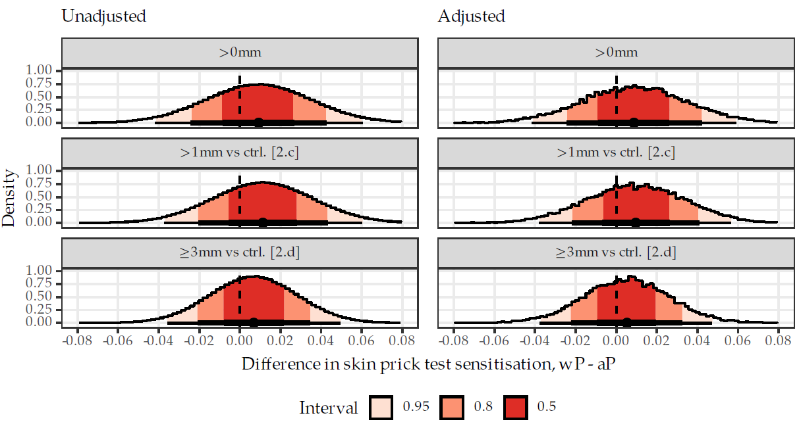

:::

::: {.column width="30%"}

::: {style="font-size: 80%;"}

Estimated difference in SPT (>1mm) sensitisation probability (wP vs. aP): ​

::: {.list-table aligns="c"}

- - Median (95% CrI)

- - 0.01 (-0.04, 0.06)

:::

→ Uncertain direction, but any difference likely
to be small​

\

Allergic sensitisation similar in both groups. Vaccine type did not appear to influence early sensitisation.

:::

:::

::::

## IgE-mediated Food Allergy Outcomes

- Criteria 1.i - positive OFC
- Criteria 1.ii - clinician-confirmed food anaphylaxis
- Criteria 2. - highly probable IgE-mediated food allergy

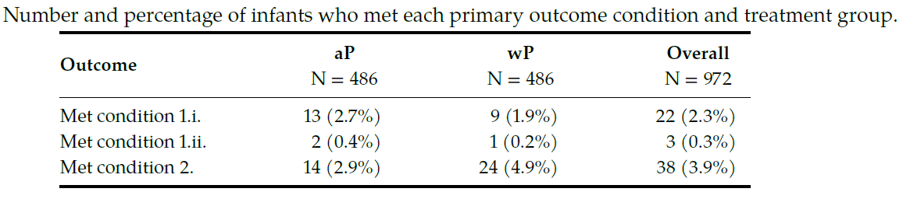

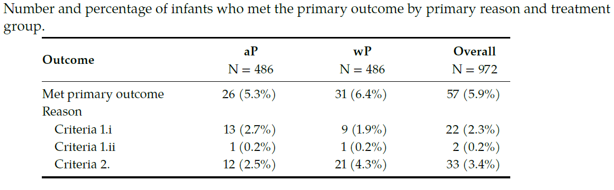

## IgE-mediated Food Allergy Results

:::: {.columns}

::: {.column width="70%"}

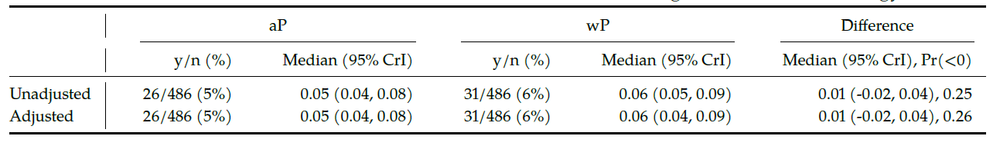

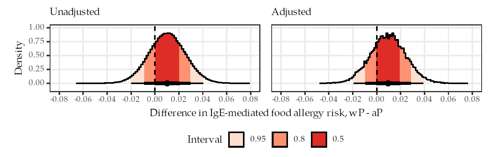

:::

::: {.column width="30%"}

::: {style="font-size: 80%;"}

Estimated difference in SPT (>1mm) sensitisation probability (wP vs. aP): ​

::: {.list-table aligns="c"}

- - Median (95% CrI)

- - 0.01 (-0.02, 0.04)

:::

→ Uncertain, but any difference likely
to be small​

\

- Food allergy rates were similar in both groups
- Estimated effect was uncertain but small
- Results do not show a reduction in food allergy

:::

:::

::::

## Eczema Outcomes

:::: {.columns}

::: {.column width="40%"}

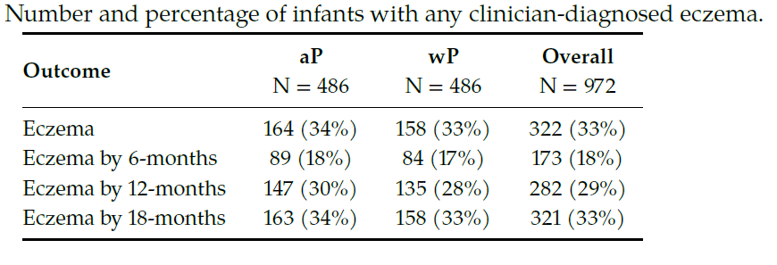

:::

::: {.column width="60%"}

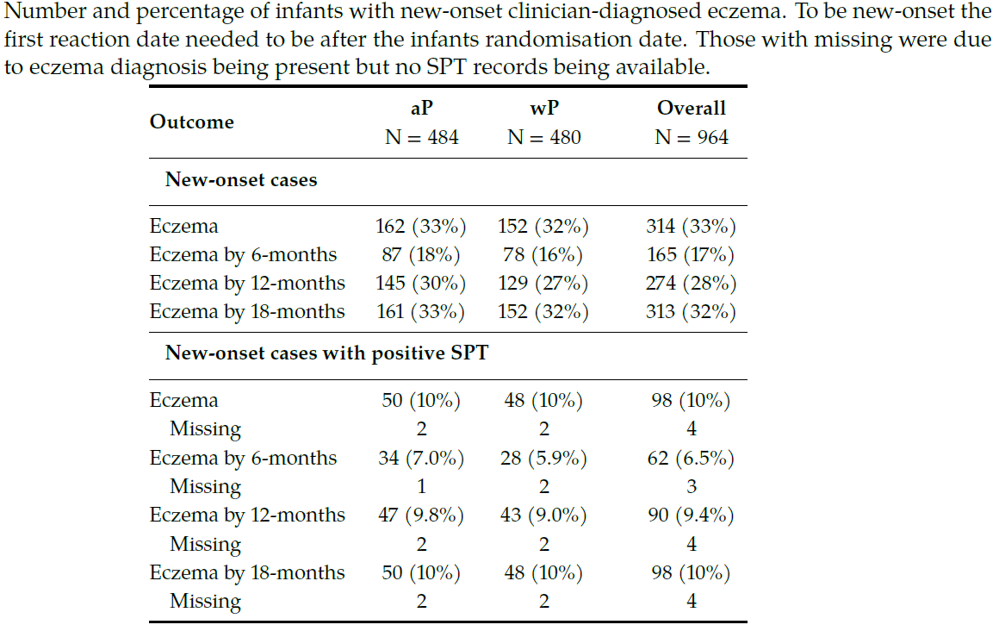

:::

::::

## Eczema Results

:::: {.columns}

::: {.column width="70%"}

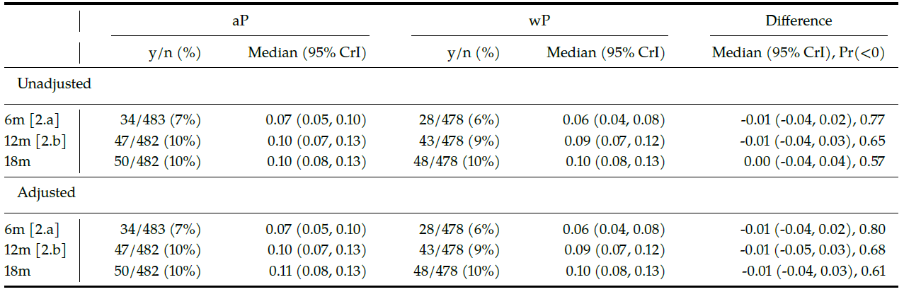

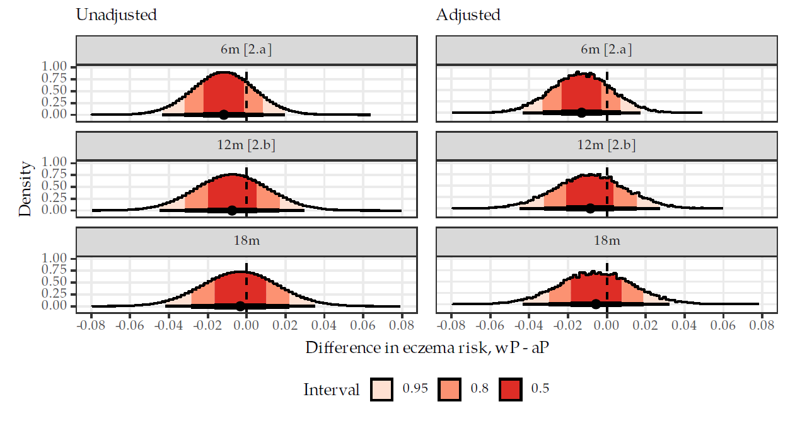

:::

::: {.column width="30%"}

::: {.fragment}

::: {style="font-size: 80%;"}

Estimated difference in probability of eczema by 6-months (wP vs. aP): ​

::: {.list-table aligns="c"}

- - Median (95% CrI)

- - -0.01 (-0.04, 0.02)

:::

→ Uncertain direction, but any difference likely
to be small​

\

- eczema rates were similar between groups
- estimated effect was uncertain but small
- results do not show a reduction in eczema

:::

:::

:::

::::
